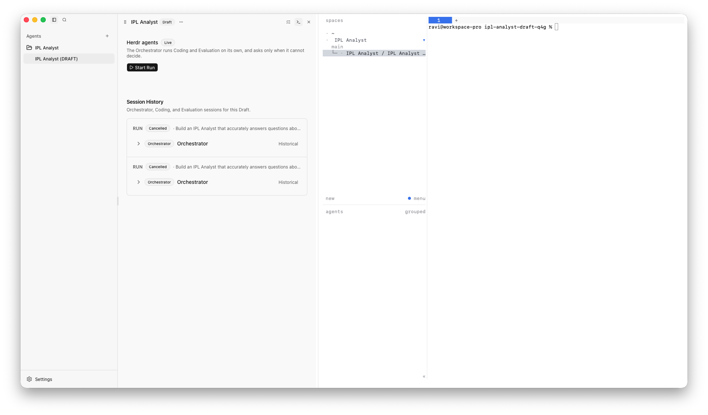
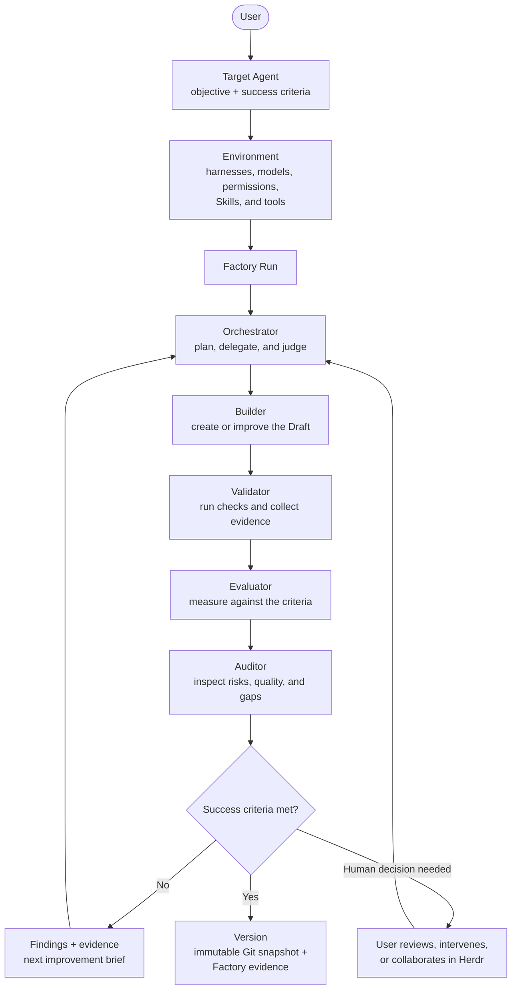
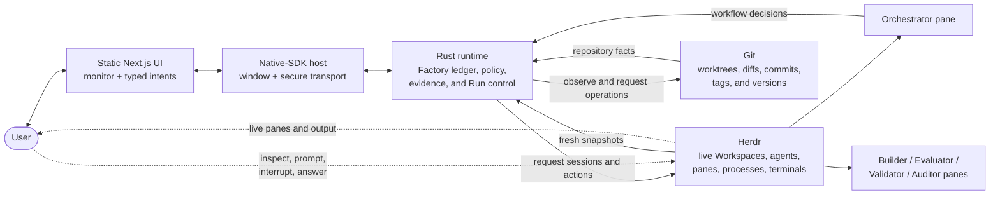

# Agent Factory

> An experimental factory where agents collaborate to build, evaluate, and
> improve other agents.

Software factories can produce many software products from a reusable process.
Agent Factory explores the same idea for agents: define the agent you want,
describe how success will be measured, assemble a team of specialized agents,
and run an evidence-driven improvement loop until the target is ready.

The product being made is the **Target Agent**. The factory is the repeatable
system around it: orchestration, isolated workspaces, role-specific agents,
evaluation, human oversight, durable evidence, and versioned results.

Agent Factory is a macOS desktop application built on
[Herdr](docs/spec/herdr.md). Herdr is the live agent runtime and collaboration
surface. It owns the Workspaces, panes, processes, terminals, and lifecycle of
the agents doing the work. Agent Factory supplies the product definition,
control policy, history, and user experience around that runtime.



## From a goal to an improved agent

A Target Agent begins with two inputs:

- an **objective** that states what the agent should accomplish; and
- **measurable success criteria** that define the evidence required to accept
  it.

The user then selects an Environment for the work. An Environment describes
the harnesses, model policy, permissions, variables, Skills, and MCP tools
available to the agents in a Factory Run. This makes the same factory reusable:
different targets can use different capabilities without changing the factory
itself.

When a Run starts, Agent Factory creates a fresh Orchestrator session through
Herdr. The Orchestrator turns the objective into work, delegates it to
specialized agents, judges their evidence, and decides whether to iterate,
escalate, or finish. Each managed agent runs in its own Herdr pane so its work
can be observed and addressed directly.



The loop is explicit rather than inferred from terminal output:

1. **Build** — a Builder changes the target agent in its Draft worktree.
2. **Validate** — focused checks establish whether the change works as
   intended and capture reproducible evidence.
3. **Evaluate** — an independent agent compares the result with the declared
   success criteria.
4. **Audit** — an additional pass looks for quality, safety, security, or
   compliance gaps that a narrow evaluation may miss.
5. **Improve or finish** — the Orchestrator turns findings into the next build
   brief, asks the user for a decision when necessary, or records a passing
   result.

The current executable Run contract has first-class **Orchestrator**,
**Coding** (Builder), and **Evaluation** sessions. Validator and Auditor are
specialized managed-agent responsibilities or evaluation passes within the
same loop, rather than competing durable Run state machines. The project is
experimental, and these role boundaries will continue to be refined from real
workflows.

## A configurable agent team

The roles describe responsibilities, not fixed model vendors or bundled
executables. A user can shape each role by choosing the harness and the
Environment capabilities needed for the target:

| Role | Responsibility |
| --- | --- |
| **Orchestrator** | Owns workflow decisions, delegates work, reviews evidence, requests another iteration, escalates, and declares the final outcome. |
| **Builder** | Implements or revises the Target Agent, its prompts, tools, Skills, tests, and supporting code. |
| **Evaluator** | Independently measures the current Draft against the stated success criteria and returns structured findings. |
| **Validator** | Runs focused checks, tests, and scenarios so claims are backed by reproducible evidence. |
| **Auditor** | Reviews the broader result for risks, regressions, policy concerns, and blind spots before acceptance. |

The same harness can fill several roles, or different harnesses, models,
permissions, Skills, and tools can be selected for different responsibilities.
Herdr discovers the available harness kinds; Agent Factory does not bundle or
install agents and does not start or manage the Herdr server.

Only the Orchestrator receives authority to issue semantic Run commands.
Builder, Evaluator, Validator, and Auditor agents receive the context and
capabilities they need, but cannot silently advance or finish the Run.

## Monitor and collaborate in real time

Agent Factory is designed as a control plane, not a fire-and-forget job runner.
While the factory is operating, users can:

- see the complete live agent tree for the current Herdr Workspace;
- inspect which agents are working, settled, blocked, or no longer live;
- focus an agent's pane and read its recent output;
- prompt or resume settled agents, interrupt working agents, and respond to an
  agent's native question or approval surface;
- follow Run iterations, evaluation findings, changed files, and test evidence;
  and
- answer an Orchestrator escalation and continue the same Run.

Herdr remains the source of truth for what is running now. Agent Factory keeps
the durable reason the work exists, the managed-session lineage, accepted
evidence, and final result. Closing a pane does not cancel a Run, and a terminal
lifecycle label never manufactures a semantic verdict.

## A factory, not another single-agent framework

Many agent frameworks help developers define and invoke one agent. Agent
Factory operates one level above that problem: it is infrastructure for
repeatedly producing and improving **different** agents.

| Individual-agent framework | Agent Factory |
| --- | --- |
| The main product is one agent or agent graph. | The main product is a reusable process that can produce many Target Agents. |
| Success is often that an invocation completed. | Success is declared up front as measurable criteria and must be supported by evidence. |
| Building, testing, and review happen outside the framework. | Builder, Evaluator, Validator, and Auditor responsibilities participate in one coordinated loop. |
| Runtime state and product history are often treated as one thing. | Live Herdr state, Git facts, and durable Factory records have separate authorities. |
| Human input is commonly limited to starting a run or reading its output. | Users can monitor, intervene, and collaborate with every live agent through Herdr. |
| The result is usually an execution. | The result can become a versioned, reproducible Target Agent that the factory can refine again. |

The long-term goal is not a perfect agent produced once. It is a reusable
factory that can create, measure, version, and continuously refine many kinds
of agents as their goals, environments, and success criteria evolve.

## Architecture and authority

Agent Factory joins several authorities into one honest view. It does not copy
their state into a second writable runtime.



- **React** renders validated projections and emits typed intents.
- **Native-SDK** owns the window, platform integration, packaging, security
  policy, and opaque sidecar transport.
- **Rust** owns the durable Factory ledger, control policy, Environments,
  evidence, recovery, and authenticated Run commands.
- **Herdr** owns live agent topology, processes, terminals, and lifecycle.
- **Git** owns repository, worktree, diff, commit, and tag facts.
- **The Orchestrator** owns the decision to delegate, iterate, evaluate,
  escalate, or finish.

This separation lets users see a unified workspace without allowing stale UI,
cached runtime data, or terminal text to overrule the system that actually owns
the fact.

The detailed model and accepted decisions live in [`docs/spec/`](docs/spec/),
starting with [architecture ownership](docs/spec/ownership.md) and the
[Herdr integration](docs/spec/herdr.md). Repository contribution rules are in
[`AGENTS.md`](AGENTS.md).

## Core product concepts

- A **Target Agent** is the reusable product definition.
- A **Draft** is a mutable version of that definition in one worktree.
- A **Version** is an immutable Git commit and tag plus Factory metadata.
- A **Workspace Binding** connects a Target Agent to a project or worktree and
  its current Factory-managed Herdr Workspace.
- A **Factory Run** records one attempt to improve a Draft: its objective,
  criteria, managed sessions, evidence, escalation, and outcome.
- An **Environment** resolves the provider, model policy, variables, harnesses,
  permissions, plugins, Skills, and MCP tools applied to new sessions.

## Requirements

- macOS 13 or newer
- Node.js 24 or newer
- pnpm 11 or newer
- Rust 1.93.1 (pinned by `rust-toolchain.toml`)
- Native-SDK through the pinned `@native-sdk/cli` package
- Herdr running, with the agent kinds you intend to use available to it

## Development

```bash
pnpm install --frozen-lockfile
pnpm dev:web
pnpm native:dev
```

`pnpm dev:web` serves only the static browser UI at
`http://127.0.0.1:3000/`. `pnpm native:dev` builds the Rust runtime and loads
that origin inside the Native-SDK WebView. Herdr must already be running.

Production uses a Next.js static export served from the sealed application
bundle; there is no Next.js server.

## Verification

```bash
pnpm validate
pnpm test
pnpm smoke:web
pnpm build
pnpm native:package
```

`pnpm smoke` adds Native-SDK bridge coverage. macOS release packaging produces
separate arm64 and x86_64 signed and notarized archives with SBOMs and
checksums.

## Release trust

Agent Factory fails closed when release trust inputs are absent. Local and
development packages seal a disabled update configuration. Release packages
enable updates only when CI injects a pinned public key and key ID plus signed
manifest endpoints; the Rust runtime then requires explicit version
confirmation before secure extraction and updater-helper installation. Plugin
catalogs likewise require an exact-byte Ed25519 signature and verified artifact
hash before installation.

## Experimental scope

Agent Factory is greenfield and under active development. Release 0.1
intentionally excludes Automations, Tasks, standalone MCP and Skills
management, hosted gateway infrastructure, and bundled agents.

Application-level LLM Providers are reusable configuration records. An
Environment may be authored without a provider and becomes launch-ready only
after its provider and model policy are configured. Rust exposes the selected
provider to each Harness agent through a session-scoped loopback gateway.
Plugin MCP servers and Skills remain Environment-selected capabilities, not
standalone product areas.
